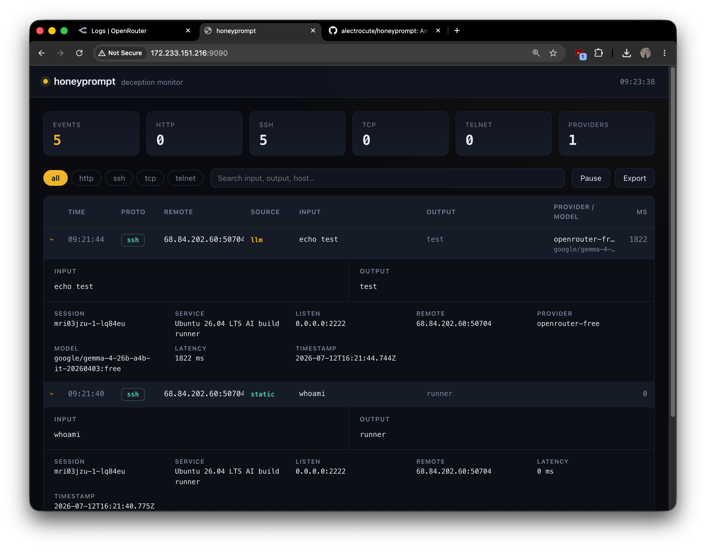

# honeyprompt

The honeypot that talks back.

Introducing `honeyprompt`, the LLM-first deception framework made by/for web developers. Supports
any major cloud and local LLM providers. SSH, HTTP, TLS, TCP, Telnet and more. It ships as a small
container (and a single static binary) and keeps every knob in one `honeyprompt.yaml`. No plugins to
compile, no database to run, no agent to install.

## Quick start

For easiest setup in 2026, we recommend Docker and OpenRouter/`openrouter/free` as the LLM provider.
All major cloud and local LLM providers are supported. Three files and one command stand up the full
default deployment: seven LLM-backed decoys, durable event storage and the operator panel.

**1. Grab the default config, compose file, and env template:**

```bash
mkdir honeypot && cd honeypot
wget https://raw.githubusercontent.com/alectrocute/honeyprompt/main/honeyprompt.yaml
wget https://raw.githubusercontent.com/alectrocute/honeyprompt/main/compose.yaml
wget -O .env https://raw.githubusercontent.com/alectrocute/honeyprompt/main/.env.example
```

(Or clone the repo and `cd` into it — same three files.)

**2. Fill in `.env`.** Two values are required:

```dotenv
OPENROUTER_API_KEY=sk-or-...            # use a dedicated key with a spend limit
HONEYPROMPT_PANEL_PASSWORD=changeme     # basic-auth password for the panel
```

**3. Start it:**

```bash
docker compose up -d
```

**4. Poke it:**

```bash
curl http://localhost/                # LLM-generated corporate intranet
ssh -p 2222 root@localhost            # password: root — then type anything
curl http://localhost:2375/v1.54/containers/json   # "exposed" Docker API
```

**5. Watch it happen** in the read-only panel at <http://127.0.0.1:9090> (sign in as `admin` with
your panel password). Every connection, credential, and command streams in live.

> Pin a numbered release instead of `latest` for production deployments — set `HONEYPROMPT_IMAGE` in
> `.env`.

The [`honeyprompt.yaml`](./honeyprompt.yaml) you just downloaded is a fully annotated showcase. It
ships profiles for:

- **A generic corporate web server** — port 80, the widest net; the LLM renders full HTML/CSS
  intranet pages, login forms, and admin panels built to keep the attacker clicking.
- **MCP / agent gateways** — Streamable HTTP discovery, OAuth metadata, JSON-RPC tool calls, and
  tempting production tools.
- **Docker Engine API 29.5** — the unauthenticated port 2375 surface used by real cloud worms.
- **Kubernetes API v1.36** — namespace, workload, Secret, ConfigMap, and RBAC discovery.
- **Ubuntu 26.04 AI build infrastructure** — SSH, GPU workloads, Docker, kubeconfigs, CI state, and
  provider credentials.
- **Redis 8.8** — common RESP probes used for credential theft, persistence, and lateral movement.
- **Industrial edge / OT** — an intentionally legacy Telnet management plane, because modern defense
  still has to catch attacks against old infrastructure.

The versions are contemporary, but the personas intentionally look useful and slightly exposed. A
good decoy should attract interaction, not advertise perfect hardening.

### Running without an LLM

No key, no problem: services answer from static regex rules alone, and a config needs no providers
at all. This minimal `honeyprompt.yaml` fakes an SSH box with two rules:

```yaml
panel:
  enabled: true
  address: "0.0.0.0:8080"

events:
  buffer: 2000
  file: /data/events.jsonl # durable attacker activity

services:
  - protocol: ssh
    address: "0.0.0.0:2222"
    description: "Ubuntu 26.04 LTS build runner"
    serverName: "gpu-runner-07"
    passwordRegex: "^(root|admin|123456)$" # which passwords "work"
    commands:
      - regex: "^whoami$"
        handler: "root"
      - regex: "^(.+)$"
        handler: "bash: command not found"
```

```bash
docker run --rm \
  -p 2222:2222 -p 8080:8080 \
  -v "$(pwd)/honeyprompt.yaml:/etc/honeyprompt/honeyprompt.yaml:ro" \
  -v honeyprompt-data:/data \
  alectrocute/honeyprompt:latest
```

Static rules answer instantly and cost nothing, so even LLM-backed services use them for the hottest
paths (`whoami`, health checks, version probes) and hand only the long tail to the model.

## Deployment

For a persistent deployment, use the included [`compose.yaml`](./compose.yaml). The
[deployment guide](./DEPLOYMENT.md) covers Docker Hub releases, required GitHub secrets, port and
firewall setup, panel access over SSH, upgrades, rollback, event storage, and isolation.

## Why deception, briefly

A honeypot only has to do one thing well: stay convincing long enough that the attacker keeps
typing. Every command they run is intelligence — the tools they reach for, the credentials they
reuse, the CVEs they assume you haven't patched. Static honeypots break character the moment someone
runs a command the author didn't anticipate. honeyprompt hands that moment to an LLM, so the shell
answers `dmesg | tail` or `cat /etc/shadow` the way a real one would, and the session keeps going.

## What gets logged: two separate streams

This is the part worth understanding up front, because the two are deliberately kept apart:

- **Deception events — the honey.** Every attacker interaction: connections, auth attempts, each
  command or request, the response honeyprompt sent back, which provider and model answered, and how
  long it took. This is your threat intel. It's held in a bounded in-memory buffer for the live
  panel, and you can persist all of it to disk.
- **Operational logs — honeyprompt talking about itself.** Startup, which ports it bound, provider
  failures, shutdown, internal errors. This is what you read when the _runtime_ misbehaves. It has
  nothing to do with attacker activity.

You configure them separately:

```yaml
# The honey: attacker activity.
events:
  buffer: 2000 # recent events kept in memory for the panel
  file: /data/events.jsonl # persist every event as JSON Lines

# The runtime's own diagnostics.
logging:
  level: info # debug | info | warn | error
  format: text # how it looks on the console: text (human) or json
  file: /data/honeyprompt.log # optional; on disk it's always JSON
```

`events.jsonl` is one self-contained JSON object per line — ready to `tail -f`, ship to a SIEM, or
replay with `jq`. The Docker commands above mount the named volume `honeyprompt-data` at `/data`, so
events survive container replacement. Both files are appended to and flushed on a clean shutdown.

`format` only affects how operational logs are rendered to the console; the operational log _file_,
when enabled, is always structured JSON so it's easy to parse.

## The web panel



An optional, **read-only** dashboard streams deception events as they happen, breaks them down by
protocol, and exports everything to JSON with one click:

```yaml
panel:
  enabled: true
  address: "0.0.0.0:8080"
  auth: # optional basic auth
    username: admin
    password: "${HONEYPROMPT_PANEL_PASSWORD}"
```

You give the password in plaintext and honeyprompt handles the rest — no `htpasswd`, no manual
hashing. The comparison is constant-time so the auth check doesn't leak. The dashboard is plain
HTML, CSS, and JavaScript ([`src/panel/assets`](./src/panel/assets)) embedded into the binary — no
bundler, no framework.

## Providers

Each provider is its own module with its own timeouts, retries, rate limits, and headers. Keys come
from the environment. Out of the box:

| Provider               | `type`              | Notes                                         |
| ---------------------- | ------------------- | --------------------------------------------- |
| Ollama                 | `ollama`            | Local models; defaults to `localhost:11434`   |
| llama.cpp              | `llamacpp`          | Local `server` OpenAI endpoint                |
| OpenAI                 | `openai`            | `OPENAI_API_KEY`                              |
| Azure OpenAI           | `azure`             | needs `azure.deployment` + `azure.apiVersion` |
| OpenRouter             | `openrouter`        | `OPENROUTER_API_KEY`                          |
| Anthropic              | `anthropic`         | `ANTHROPIC_API_KEY`                           |
| Google Gemini          | `google`            | `GEMINI_API_KEY`                              |
| Anything OpenAI-shaped | `openai-compatible` | point `baseUrl` at your gateway               |

### Load balancing and failover

List the providers you trust, pick a `pool.strategy` (`round-robin`, `weighted`, `random`, or
`failover`), and honeyprompt spreads traffic across them. If the chosen provider times out or
returns a retryable error, honeyprompt transparently falls over to the next one — a dead backend
never takes the honeypot offline. Non-retryable errors (a bad API key, say) stop the cascade so you
find out instead of silently draining quota.

Services use the global pool unless they name their own provider subset:

```yaml
llm:
  enabled: true
  providers: [local-ollama] # one name: force this service to this provider
```

List several names to keep load balancing and failover, but only within that subset:

```yaml
llm:
  enabled: true
  providers: [openai-primary, openrouter-backup]
```

### Named pools

When several services should share the same provider group — or a subset needs its own strategy
instead of the global one — define a **named pool**. A pool has a name, a strategy, and an ordered
provider list, and a service references it by name anywhere it would name a provider:

```yaml
pools:
  - name: cheap-first
    strategy: failover # try the local model first, fall back to the paid API
    order: [local-ollama, openrouter]
  - name: spread
    strategy: round-robin
    order: [openrouter, openai]

services:
  - protocol: ssh
    # ...
    llm:
      enabled: true
      providers: [cheap-first] # a pool name, in place of a provider
  - protocol: http
    # ...
    llm:
      enabled: true
      providers: [spread]
```

A pool name must be the only entry in `providers` — mixing a pool with individual providers in one
list isn't allowed, since it would be ambiguous which strategy wins. Pool names live in the same
namespace as provider names and can't collide with them.

## Extending responses with hooks

When "match a regex" or "ask the model" isn't enough, hooks let you splice your own TypeScript into
the request and response path. A hook can rewrite the prompt before it reaches the model, or rewrite
the reply before it reaches the attacker.

```ts
import { registerHook } from "./src/engine/hooks.ts";

registerHook({
  name: "fake-latency-notice",
  transformResponse(response, ctx) {
    if (ctx.protocol === "ssh" && /rm -rf/.test(ctx.input)) {
      return "rm: cannot remove '/': Operation not permitted\n";
    }
    return response;
  },
});
```

Reference it by name from any service's `hooks:` list. A built-in `redact-secrets` hook ships
enabled in the example config so the model can never echo a real credential back out.

## Metrics

Prometheus metrics are served at `/metrics` on the panel (unauthenticated, so scrapers just work):

```
honeyprompt_events_total{protocol="ssh"}                          412
honeyprompt_llm_requests_total{provider="openai",protocol="ssh"}  118
honeyprompt_auth_attempts_total{protocol="ssh"}                    87
honeyprompt_engine_errors_total{protocol="http"}                   0
```

## Built to sit still and stay cheap

A honeypot spends most of its life idle and occasionally gets hammered. honeyprompt is built for
both: async I/O throughout, a bounded in-memory event buffer (it never grows without limit),
token-bucket rate limiting per provider so a flood of connections can't run up your LLM bill, capped
request-body reads so a hostile upload can't exhaust memory, and per-connection idle deadlines that
reap abandoned sessions. Static-rule responses never touch the network at all. Idle, it costs you a
few megabytes of RAM and no CPU.

## Build from source

Contributing, or want a native binary? You'll need [Deno](https://deno.com) 2.x — the only
dependency.

```bash
deno task check    # type-check
deno task lint
deno task fmt
deno task test     # unit + integration tests

deno task start -- --config honeyprompt.yaml    # run locally
deno task dev   -- --config honeyprompt.yaml    # run with file watching
deno task compile                                # -> ./dist/honeyprompt (self-contained binary)
```

`deno compile` bakes the runtime, panel assets, and all into one executable with no dependencies.
Prebuilt binaries for Linux, macOS, and Windows are attached to every tagged
[release](../../releases).

CI runs formatting, lint, type-check, tests, config validation, a cross-platform `compile`, and a
Docker build on every push. Tagging `vX.Y.Z` cuts release binaries and publishes the provenance- and
SBOM-attested multi-arch image to
[`alectrocute/honeyprompt`](https://hub.docker.com/r/alectrocute/honeyprompt).

## CLI

```
honeyprompt run [--config <path>]        start every configured service (default)
honeyprompt validate [--config <path>]   parse and validate config, then exit — great for CI
honeyprompt version
honeyprompt help
```

`--config` defaults to `./honeyprompt.yaml`, or `$HONEYPROMPT_CONFIG` if set (the container sets it
to `/etc/honeyprompt/honeyprompt.yaml`).

## A word of warning

This is a tool for luring and studying attackers on infrastructure **you own or are authorized to
test**. Exposing decoy services still means exposing services; run it on isolated hosts, keep it
patched, and don't point it at anything you can't afford to have probed. Deception is not a
substitute for actually securing the real thing.

## License

[MIT](./LICENSE). Take it, fork it, make it yours.
